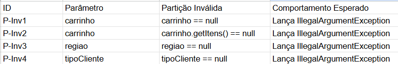
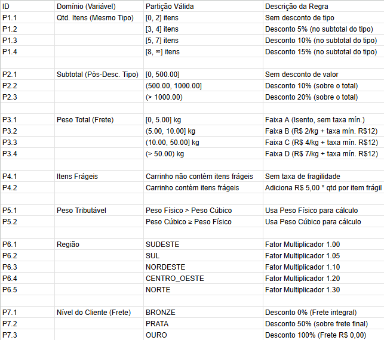
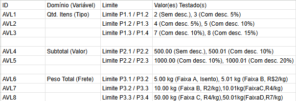
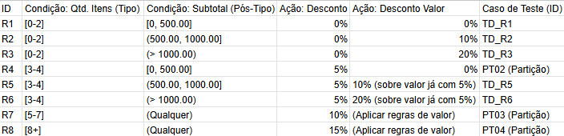
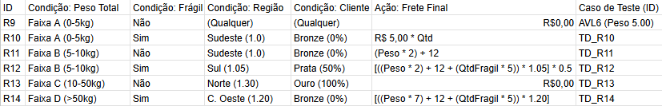
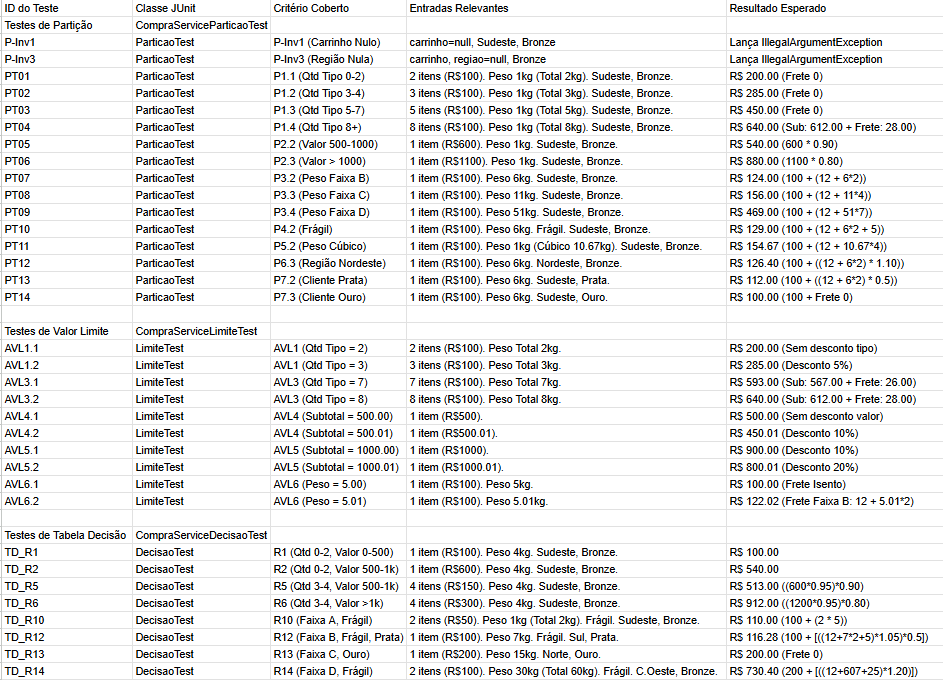

# Projeto de Testes de Software - E-commerce

Este projeto foca na aplicação de testes de unidade, funcionais (caixa preta) e estruturais (caixa branca) para o método `calcularCustoTotal` da classe `CompraService` em uma aplicação de e-commerce.

O objetivo é garantir a corretude do cálculo de custo total, que inclui descontos por tipo de produto, descontos por valor total do carrinho e um complexo sistema de cálculo de frete baseado em peso, fragilidade, região e nível do cliente.

## Como Executar os Testes

Este é um projeto Maven. Para executar todos os testes de unidade, utilize o comando:

```bash
./mvn test
```

## Como Verificar a Cobertura de Testes
O projeto está configurado com o plugin JaCoCo. Para gerar o relatório de cobertura após a execução dos testes, execute:

```bash
./mvn verify
```

O relatório de cobertura vai estar disponível em: target/site/jacoco/index.html

## Testes de Caixa Preta

### Análise de Partição
#### Entradas Inválidas


#### Entradas Válidas


### Análise de Valor Limite


### Tabela de Decisão

#### Regras de Subtotal + Desconto


#### Regras de Frete



### Documentação dos Casos de Teste 


## 5. Testes de Caixa Branca (Análise Estrutural)

Esta seção detalha a aplicação dos critérios de teste de caixa branca ao método `calcularCustoTotal` e seus métodos privados auxiliares.

### 5.1. Complexidade Ciclomática e Independência de Caminhos

Primeiro, calculamos a Complexidade Ciclomática (V(G)) do calcularCustoTotal (incluindo seus métodos auxiliares). Esse número nos diz qual o número mínimo de testes necessários para cobrir todos os caminhos lógicos independentes do código.

#### Cálculo da Complexidade Ciclomática (V(G))

A fórmula é simples: V(G) = D + 1, onde D é cada "ponto de decisão" (if, else if, for, switch, etc.) que encontramos no fluxo.

1.  `if (carrinho == null || carrinho.getItens() == null)` (D=1)
2.  `if (regiao == null || tipoCliente == null)` (D=1)
3.  `if (carrinho.getItens().isEmpty())` (D=1)
4.  `for (SubTotalPorCategoria ...)` (D=1, loop)
5.  `if (totalQuantidade >= 8)` (D=1)
6.  `else if (totalQuantidade >= 5)` (D=1)
7.  `else if (totalQuantidade >= 3)` (D=1)
8.  `if (total.compareTo(VALOR_MIN_DESCONTO_20) > 0)` (D=1)
9.  `else if (total.compareTo(VALOR_MIN_DESCONTO_10) > 0)` (D=1)
10. `for (ItemCompra itemCompra : itens)` (D=1, loop)
11. `if (produto.isFragil())` (D=1)
12. `if (totalPeso.compareTo(LIMITE_PESO_FAIXA_A) <= 0)` (D=1)
13. `else if (totalPeso.compareTo(LIMITE_PESO_FAIXA_B) <= 0)` (D=1)
14. `else if (totalPeso.compareTo(LIMITE_PESO_FAIXA_C) <= 0)` (D=1)
15. `if (!isentoTaxaMinima)` (D=1)
16. `if (tipoCliente == TipoCliente.OURO)` (D=1)
17. `else if (tipoCliente == TipoCliente.PRATA)` (D=1)

* **Total de Decisões (D) = 17**
* **Complexidade Ciclomática V(G) = 17 + 1 = 18**

#### Número Mínimo de Casos de Teste Independentes

Um V(G) de 18 significa que precisamos de, pelo menos, 18 casos de teste distintos para garantir uma cobertura completa dos caminhos.

As suítes criadas (CompraServiceParticaoTest, CompraServiceLimiteTest e CompraServiceDecisaoTest) juntas ultrapassam esse número.
### 5.2. Cobertura MC/DC (Modified Condition/Decision Coverage)

Para uma cobertura estrutural mais rigorosa, temos que analisar a decisão composta mais complexa do método, que neste caso são os validadores de entrada:

**`if (carrinho == null || carrinho.getItens() == null)`**

O critério MC/DC exige que demonstremos que cada condição (A: carrinho == null e B: carrinho.getItens() == null) pode determinar o resultado final da decisão (neste caso, lançar a exceção).

Para isso, precisamos de "pares de testes" que isolem o impacto de cada condição enquanto mantêm as outras constantes.
Para MC/DC, cada condição (A e B) deve demonstrar que pode afetar o resultado da decisão.

#### Tabela MC/DC: Decisão × Condições × Casos de Teste

| ID do Teste | Condição A (`carrinho == null`) | Condição B (`carrinho.getItens() == null`) | Resultado (Decisão: Lança Exceção?) | Justificativa (Par que Isola) | Caso de Teste JUnit (de `CompraServiceParticaoTest`) |
| :--- | :---: | :---: | :---: | :--- | :--- |
| 1 | **T** | *Ignorado (F)* | **T** | Isola A (comparado com Teste 2) | `calcularCustoTotal_particaoInvalida_carrinhoNulo` |
| 2 | **F** | F | **F** | Isola A (comparado com Teste 1) <br> Isola B (comparado com Teste 3) | `calcularCustoTotal_particaoValida_carrinhoVazio` |
| 3 | F | **T** | **T** | Isola B (comparado com Teste 2) | `calcularCustoTotal_particaoInvalida_itensNulos` |
